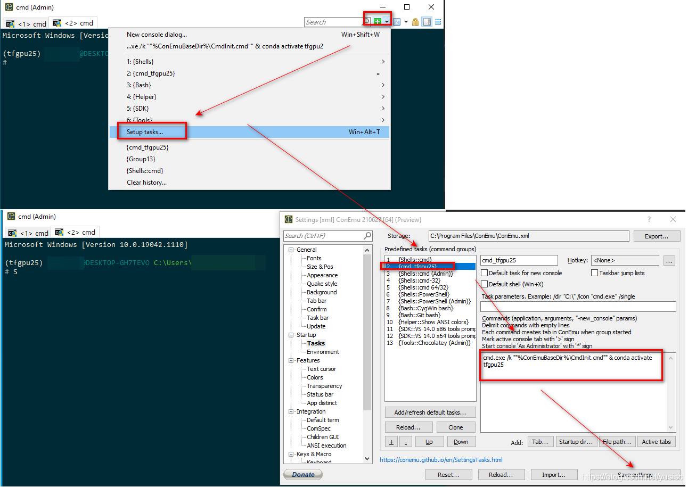
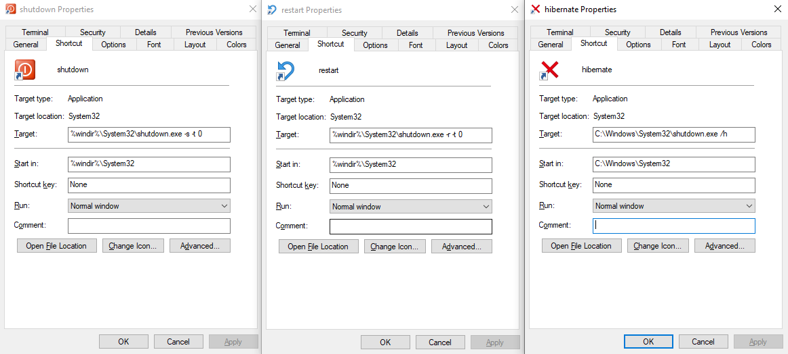

# windows add `open command line` option to `context menu`
- create new file `cmd_here.reg`, copy following into the file. 
- and double click to regist.

```
Windows Registry Editor Version 5.00

[HKEY_CLASSES_ROOT\Directory\Background\shell\cmd here]
"Icon"="\"C:\\__owyn\\__applications\\cmder\\icons\\cmder_red.ico\",0"

[HKEY_CLASSES_ROOT\Directory\Background\shell\cmd here\command]
@="\"C:\\Windows\\System32\\cmd.exe\" \"--working-dir\" \"%v.\""
```

# activate a conda env while open new terminal in conemu

```bash
cmd.exe /k ""%ConEmuBaseDir%\CmdInit.cmd"" & conda activate tfgpu25
```



# windows shut down shortcut
```
shutdown  :    %windir%\System32\shutdown.exe -s -t 0
restart   :    %windir%\System32\shutdown.exe -r -t 0
hibernate :    %windir%\System32\shutdown.exe /h
```


